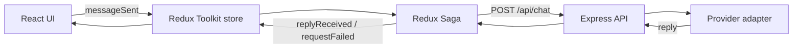

# Signal Desk

Signal Desk is a React + Redux + Redux Saga + Node/Express project built to demonstrate how a real AI chat workflow is orchestrated from the UI to the backend and back again.

The app is designed to show how a request moves through a modern frontend stack: a user action triggers Redux state updates, Redux Saga handles the side effect, Express validates and forwards the request, and an AI provider adapter returns a response.

This is a strong portfolio project because it demonstrates architecture thinking, async orchestration, API integration, and frontend state management in a single, readable app.

## Why this project stands out

- Clear separation of concerns across UI, state, side effects, and server logic
- Real request lifecycle from `React` to `Redux` to `Saga` to `Express`
- Provider abstraction with a deterministic fallback for local development
- Conversation summary flow using a second Saga path
- Test coverage around reducer and saga behavior

## Stack

- React 19 + TypeScript
- Redux Toolkit
- Redux Saga
- Node.js + Express
- Vite
- Vitest + Supertest
- GitHub Codespaces dev container

## Run locally

With Node.js 22 or newer installed:

```bash
npm install
npm run dev
```

Then open:

- Frontend: http://localhost:3000
- API: http://localhost:4000

## Run in GitHub Codespaces

This repository includes a dev container configuration so the app can run in a consistent environment without installing Node locally.

1. Open the repository in GitHub.
2. Choose **Code** → **Codespaces**.
3. Create a codespace.
4. The dev container installs dependencies and starts the app automatically.

The frontend is served on port `3000` and the API runs on port `4000`.

## Environment setup

The provider adapter supports an OpenAI-compatible provider and falls back to a deterministic local mock when no key is configured.

Copy `.env.example` to `.env` and update the values as needed:

```bash
AI_API_KEY=
AI_API_ENDPOINT=https://api.groq.com/openai/v1/chat/completions
AI_MODEL=llama-3.1-8b-instant
PORT=4000
```

Notes:

- `AI_API_KEY` is optional for local development.
- Leave it blank to use the fallback mock provider.
- `AI_API_ENDPOINT` should point to an OpenAI-compatible chat completions endpoint.
- `AI_MODEL` should be a valid model name for the selected provider.

## Project structure

```text
src/
  App.tsx
  chatSlice.ts
  sagas.ts
  store.ts
  styles.scss
server/
  index.js
  provider.js
vite.config.ts
package.json
README.md
```

## Architecture



## Request lifecycle

1. The user submits a prompt in the UI.
2. React dispatches a Redux action.
3. Redux stores the user message and toggles loading state.
4. Redux Saga calls the API side effect.
5. Express validates the request and calls the provider adapter.
6. The provider returns a reply or an error.
7. Saga dispatches a success or failure action back into Redux.
8. The UI re-renders the updated conversation.

## Available commands

```bash
npm install
npm run dev
npm test
npm run build
npm run server
npm start
```

## Testing

The project includes automated test coverage for the reducer and saga flow:

- successful request handling
- failed request handling
- message state transitions
- conversation summary flow
- API validation and provider behavior

Run the suite with:

```bash
npm test
```

## Future improvements

Some logical next steps for this project include:

- real provider integration with Groq or OpenAI
- streaming responses for a more chat-like experience
- persisted multi-thread conversations
- deployed frontend and API hosting for a portfolio demo
- richer UI polish and system status views

## Portfolio summary

Signal Desk demonstrates practical skills that employers look for in frontend and full-stack work:

- React state architecture
- Redux + Saga async flow design
- Node API integration
- provider abstraction patterns
- test-driven reasoning
- clean separation of responsibilities in a small app

This is a solid example of a modern frontend architecture and an approachable AI orchestration demo.
